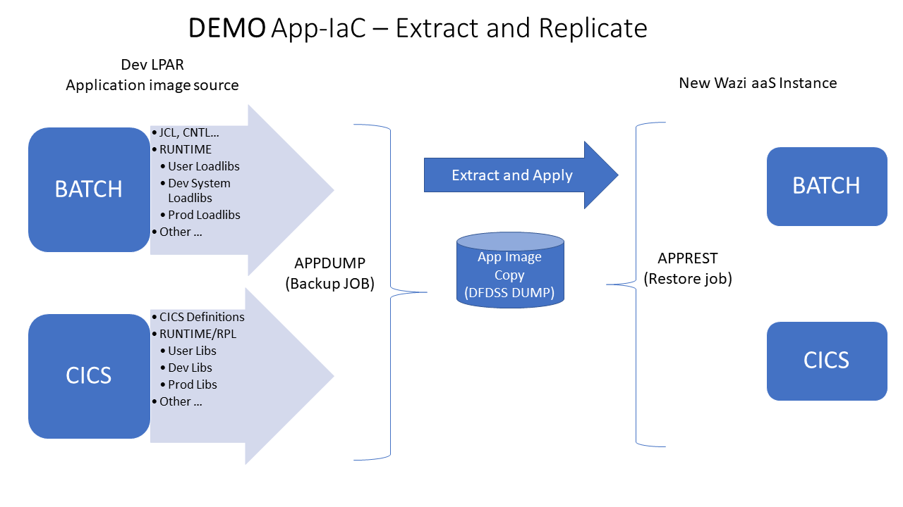

# Learn Terraform for Wazi aaS basics - by NLopez 
This repo has 2 folders to help you learn how to create a new Wazi aaS instance using terraform HCL scripts.

The folders are:
- ``` learn-terra-basic ``` provides a highlevel overview of the HCL scripting lanuage using a local resources.  
- ``` learn-terra-wazi ``` a more advanced example that creates a new Wazi aaS instance (VPC/VSI) using the 'experimental' release. This folder also includes a protoype **Application IaC** process to demonstrate how to re-create an application runtime on a new zOS instance for build and test. 


## The 'learn-terra-basics' folder 
This folder has a sample *.tf files.  They  provide some getting started tips on how to use HashiCorp's Terraform HCL scripting language. For more details see https://learn.hashicorp.com/collections/terraform/cli


### Install terraform on windows
- Install terraform for windows https://releases.hashicorp.com/terraform/1.2.4/  (or any supported OS)
- Add the executable to the path using (Windows) ``` SETX PATH ...```
- A nice to have is the HCL vsCode extension https://marketplace.visualstudio.com/items?itemName=HashiCorp.terraformthe 

>TIP: In vsCode, open a terminal to run terraform commands by right clicking the project folder and selecting "Open in Integrated terminal". 

### After the install
Use the basics folder or create your own with any name to build your .tf scripts. From the cli, run terraform cmds like  -  'terraform init', plan, apply, show, destroy  

To start learning, open the sample main.tf script and follow the notes. 

For more on IBM's Terraform plugin, scroll to the "VPC infrastructure" topic in:
   https://registry.terraform.io/providers/IBM-Cloud/ibm/latest/docs


## The 'learn-terra-wazi' folder   
The main.tf terraform script is derived from [IBM Sample terraform repo](https://cloud.ibm.com/docs/ibm-cloud-provider-for-terraform?topic=ibm-cloud-provider-for-terraform-sample_vpc_config)

It creates a VPC/VSI instance using a pre-defined local ssh-key and an IBM Cloud account api key with access to the new 'Wazi aaS' image. 

In windows, run the ssh-keygen cmd and [add your public key to your cloud acct](https://cloud.ibm.com/docs/ssh-keys?topic=ssh-keys-adding-an-ssh-key). Then [access your cloud acct's apikey](https://www.ibm.com/docs/en/app-connect/containers_cd?topic=servers-creating-cloud-api-key) and add it as a local environment varaiable using SETX IC_API_Key="<apikey>" (or add the key in a script - but thats not recommended)


Open a terminal and run terraform cmds under this folder using the standard flow:
   - **init**
   - **plan**
   - **apply**  
   - and eventualy **destroy**
   - **show** to view your current state 

> Some tweaks made to the IBM sample
+ Due to permission restrictions in the demo Cloud acct, a few extra vars were added  like; resource group, image name and a pre-existing ssh key plus a few more.  
+ Most resource blocks have been updated to include the resource group id.
+ The IBM sample does not adhere to normal terraform file naming conventions. For example it calls the main script `vpc.tf`.  I changed it to `main.tf`.  But terraform really doesnt care what you call the file as long as it ends in .tf 

[**FYI: This is a link to IBM terraform plugin Doc](https://cloud.ibm.com/docs/ibm-cloud-provider-for-terraform?topic=ibm-cloud-provider-for-terraform-provider-template#code-snippets)


## Application IaC - Demo on 'how to replicate an Application Runtime on a new zOS image' 
This folder includes a sample IaC script (App-IaC/postinit.bat) to demostrate how an applicaiton can be replicated on a new zOS instance for build and testing. The script uses standard IBM utilities to create a portable image made up of joblibs, CICS RPL libs, CNTL, JCL...  Application source is made available via Git. 

The script transports an image to a new zOS instance and restores both the batch and CICS components. It also helps configure various other components like installing a local CERT for 3270 access... 



The postinit script: 
   - Runs a DUMP job on your Dev LPAR to capture your application's image - see  App-IaC/APPDUMP.jcl.
   - Runs SFTP scripts to transmit the image to the new zOS instance and restores the files - see  App-IaC/APPREST.jcl.
   - Runs a job to define your App's CICS defintion - see App-IaC/CICSDEF.jcl
   - Replaces the stock CICS STC JCL with your own copy to include your restored RPL libs - see App-IaC/CICSTS56.jcl. 


When you run the ```terraform apply``` cmd from this folder, it will prompt you to start the postinit script. The script will prompt you along the way. 


### Tech Notes 
The experimental Wazi image (as of June 2022) is configured with TN3270, SSH, Git, DBB, RSE, RSEAPI, z/OSMF, GO and BASH. Zowe and Open Editor for VScode are supported.

After the IPL you can manually setup IDz, Zowe and 3270 access.  SSH into USS which uses the local SSH key used during the VSI creation. 

 
### Default User ID, IP & Ports
The terra script creates a floating IP which is used to access the system after the IPL. You can view the IPL state from your Cloud account by selecting the new VSI 'action' menu item 'view serial term'.  You can also re-ipl from that menu. 

**User ID**
The default RACF user is IBMUSER and password is SYS1. One first logon you will need to reset the password. To reset it back to a the default, run this from a term:
> ssh IBMUSER@mywazi tsocmd 'ALTUSER IBMUSER PASSWORD(sys1)'

If you have trouble accessing the system try a re-IPL.  

**Ports**
- **3270=992** you will need a 3270 emulator that accepts certs on port 992 using TLS and MS-CAPI (windows). PCOM and IDz Host term dont seem to work reliablity - I use Vista.   The postinit.bat script installs the cert from z/OS to your local windows registry (review windows MMC certificate snap-on for more advanced cert related features). 
- **RSE=8137**
- **RSEAPI=8195**
- **zOSMF=10443** 
- **CICS REGION CICSTS56, CMCI=8154**

**DBB**
Both git and DBB and zappbuild are preinstalled. Build.groovy can be found in /u/ibmuser/waziDBB/dbb-zappbuild.  The DBB Daemon is not needed as JAVA performance is not an issue. 

Pipelines can be configured with the instance's IBMUSER acct and its public ssh key and IP.

The BASH and the 'Go' interpreter are also available.

**Example Wazi Topology**


# WIP - Ansible On Windows - An alternate version to the basic postinit.bat script 
Anisble is a script language used to configure systems. Where Terraform is a scripting lanuage to manage cloud resource. The 2 provide compilentary features to initialize and configure a new zOS instance. The prior section decribed how to use a simple windows script to perfoirm the configuration steps.   This section will explain how to use Ansible to perform those steps. 

First, You'll need to install Ansible on a unix OS as it does not run nativly on Windows. Follow the instructions provided here:
 > https://www.ibm.com/docs/en/cloud-paks/z-modernization-stack/2022.2?topic=developing-setting-up-ansible-wazi 


This example, uses a pre-install Ubuntu under VM Ware on a Widnows PC. 


1. Update Ubuntu, install Anisble with IBM plugins, install terraform, install git 
   ``` 
   sudo apt update && sudo apt upgrade   
   sudo apt install software-properties-common 
   sudo add-apt-repository --yes --update ppa:ansible/ansible 
   
   sudo apt install ansible &&   sudo apt install ansible-lint  &&  ansible-galaxy collection install ibm.ibm_zos_core
   ansible --version 
   
   sudo apt install  software-properties-common gnupg2 curl
   curl https://apt.releases.hashicorp.com/gpg | gpg --dearmor > hashicorp.gpg
   sudo install -o root -g root -m 644 hashicorp.gpg /etc/apt/trusted.gpg.d/
   sudo apt-add-repository "deb [arch=$(dpkg --print-architecture)] https://apt.releases.hashicorp.com $(lsb_release -cs) main"
   sudo apt update
   sudo apt install terraform
   terraform --version

   sudo apt install git


   ```
3. ???  From Ubuntu:
   - Run this to generate ssh keys: 
      - ``` ssh-keygen -t rsa -b 4096 -C "username@your-org.com" ```
   - Run this to add your ssh key to your zOS Dev host 
      - ssh-copy-id username@zos_ip_address

      


WSL - Ref: For full datails see https://docs.microsoft.com/en-us/windows/wsl/install

vsCode for WSL - https://docs.microsoft.com/en-us/windows/wsl/tutorials/wsl-vscode

Ansible for WSL - https://docs.ansible.com/ansible/latest/installation_guide/intro_installation.html#installing-ansible-on-ubuntu


