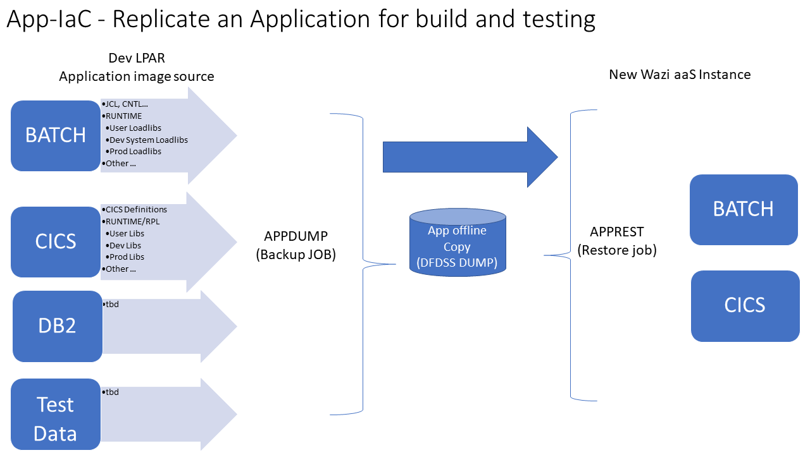

# Learn Terraform for Wazi aaS basics - by NLopez 
This repo has 2 folders to help you learn how to create a new Wazi aaS instance using terraform script and your IBM Cloud account. 

The folders are:
- ``` learn-terra-basic ``` that provides a highlevel overview of the scripting lanugae using local resources.  
- ``` learn-terra-wazi ``` is a more advanced example that creates a wazi instance using the 'special' beta release and a prototype IaC application setup.  


## The 'learn-terra-basics' folder 
This folder has a few sample *.tf files.  They  provide basic getting started tips on how to use HashiCorp's Terraform HCL scripting language. For more on getting started see https://learn.hashicorp.com/collections/terraform/cli


### Install terraform on windows
- Install terra for windows https://releases.hashicorp.com/terraform/1.2.4/  (or any supported OS)
- Add the executable to the path using (Windows) ``` SETX PATH ...```
- A nice to have is the vsCode extension https://marketplace.visualstudio.com/items?itemName=HashiCorp.terraformthe 

>TIP: In vsCode, open a terminal to run terraform cli by right clicking the project folder and selecting "Open in Integrated terminal" where you can enter 'terraform init' etc...

## After the install
Use the basics project or create your own with any name to build your .tf scripts. From the cli, run terraform cmds like  -  'terraform init', plan, apply, show, destroy  

>TIP: To skip the interactive prompt "enter yes" during an 'apply', run 'terraform apply -auto-approve'

Terra tracks diff's between applys to keep resources up to date.

To start learning, open the sample main.tf script and follow the notes. 

For more on IBM's Terraform plugin, scroll to the "VPC infrastructure" topic in:
   https://registry.terraform.io/providers/IBM-Cloud/ibm/latest/docs


## The 'learn-terra-wazi' folder   
The main.tf terraform script is derived from [IBM Sample terraform repo](https://cloud.ibm.com/docs/ibm-cloud-provider-for-terraform?topic=ibm-cloud-provider-for-terraform-sample_vpc_config)

This sample uses a pre-defined local ssh-key and an IBM Cloud account apikey with access to create a Wazi aaS image. 

In windows, run the ssh-keygen cmd and add your public key to your cloud acct. Then [access your cloud acct's apikey](https://www.ibm.com/docs/en/app-connect/containers_cd?topic=servers-creating-cloud-api-key) and add it as a local environment varaiable using SETX IC_API_Key=<apikey> (or add the key in a script - but thats not recommended)


Open a term and run terraform cmds under this folder using the standard flow:
   - **init**
   - **plan**
   - **apply**  
   - and eventualy **destroy**
   - **show** to view your current state 

> Some tweaks made to the IBM sample
+ Due to permission restrictions in the demo Cloud acct, a few extra vars were added  like; resource group, image name and a pre-existing ssh key plus a few more.  
+ Most resource blocks have been updated to include the resource group id.
+ The IBM sample does not adhere to normal terraform file naming conventions. For example it calls the main script vpc.tf.  I changed it to main.tf.  But terraform really doesnt care what you call the file as long as it ends in .tf 

[**FYI: This is a link to IBM terraform plugin Doc](https://cloud.ibm.com/docs/ibm-cloud-provider-for-terraform?topic=ibm-cloud-provider-for-terraform-provider-template#code-snippets)

## Tech Notes 
The experimental Wazi image (as of June 2022) is configured with TN3270, SSH, Git, DBB, RSE, RSEAPI, z/OSMF, GO and BASH. Zowe and Open Editor for VScode are supported.

After the IPL you can manually setup IDz, Zowe and 3270 access.  SSH into USS uses the local SSH key used during the VSI creation. 

### How to replicate an Application Runtime  on a new zOS image (experimental)
This folder also includes a sample IaC script (postinit.bat) to demostrate how to replicate an application's runtime environment. The script uses standard IBM utilities to create a portable runtime image made up of joblibs, CICS RPL libs, CNTL, JCL...

It then transports the image to the new zOS instance and restores both the batch and CICS runtimes. It also helps set up local CERT for 3270 access and other configurations. 



This process requires some planning and setup before starting your new instance. 
 - Review App-IaC/APPDUMP.jcl in this folder.  Copy it to a PDS on your Dev LPAR and follow the comments in the JCL.  This job will capture application libraries and production libraries as 2 seperate transportable files. It also extracts CICS defintions by GROUP. If you are not testing a CICS application, just remove the steps in the JCL. 

 - Review the App-IaC/CICSTS56.JCL.  This jcl is a copy of the Wazi aaS zOS JCL (CICS v56 STC) as of June 2022.  If you are testing a CICS application then, in addition to extracting CICS defintions, you will need to add your application's RPL libs and make sure to included them in the APPDUMP job. 

Once the pre-setup steps are compelete, you can run the terraform init,plan and apply. When the VSI created, run the App-IaC/postinit.bat script found in this folder to replicate you application runtime environment for DBB builds and unit testing. 


 
### Default User ID, IP & Ports
The terra script creates a floating IP which is used to access the system after the IPL. You can view the IPL state from your Cloud account by selecting the new VSI 'action' menu item 'view serial term'.  You can also re-ipl from that menu. 

**User ID**
The default RACF user is IBMUSER and password is SYS1. One first logon you will need to reset the password. To reset it back to a the default, run this from a term:
> ssh IBMUSER@mywazi tsocmd 'ALTUSER IBMUSER PASSWORD(sys1)'

If you have trouble accessing the system try a re-IPL.  

**Ports**
- **3270=992** you will need a 3270 emulator that accepts certs on port 992 using TLS and MS-CAPI (windows). PCOM and IDz Host term dont seem to work reliablity - I use Vista.   The postinit.bat script installs the cert from z/OS to your local windows registry (review windows MMC certificate snap-on for more advanced cert related features). 
- **RSE=8137**
- **RSEAPI=8195**
- **zOSMF=10443** 

**DBB**
Both git and DBB and zappbuild are preinstalled. Build.groovy can be found in /u/ibmuser/waziDBB/dbb-zappbuild.  The DBB Daemon is not needed as JAVA performance is not an issue. 

Pipelines can be configured with the instanances IBMUSER, its pre-generate public ssh key and IP for impact builds.  

The 'Go' interpreter is also available to support native GitLab runners (not tested). 

**Example Wazi Topology**

